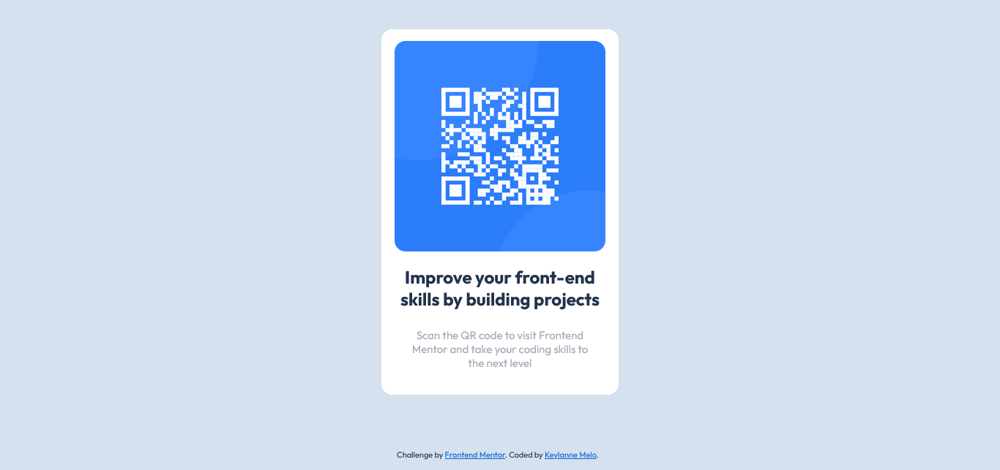

# Frontend Mentor - QR code component solution

Essa é a solução para [QR code component challenge on Frontend Mentor](https://www.frontendmentor.io/challenges/qr-code-component-iux_sIO_H). 

## Table of contents

- [Overview](#overview)
  - [Screenshot](#screenshot)
  - [Links](#links)
  - [Tecnologias utilizadas](#tecnologias-utilizadas)
- [Author](#autora)

### Screenshot

### Link

- Github: [Github Pages](https://keylanne-melo.github.io/qr-code-component-main/)

### Tecnologias Utilizadas:

- HTML5
- CSS3

## Autora

- Github - [Keylanne Melo](https://github.com/keylanne-melo)
- Frontend Mentor - [@keylanne-melo](https://www.frontendmentor.io/profile/keylanne-melo)
- LinkedIn - [Keylanne Melo](https://www.linkedin.com/in/keylanne/)

